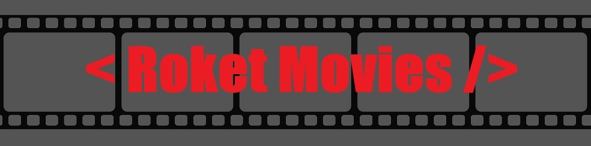

<h3 align="center" height="100px">
  
   
  

    This is a project made to train and improve my knowledge in NodeJs and ReactJs among others...
  

   
</h3>

  

<h1 align="center">
  📥 Requirements to install the project
</h1>

  1º: Node <a href='https://nodejs.org/en/'> Install </a>  

  2º: VScode <a href='https://code.visualstudio.com/download'> Install </a>  

  3º: Git <a href='https://git-scm.com/downloads'> Install </a>  

  

<h1 align="center">
  🖋️ Project
</h1>

  

<h1 align="center">
  🙋‍♂️ Isaac Moretão 
</h1>

  I'm a Programming Student focused on ReactJs, I'm looking for my first job 
  as a programmer in the job market, you can see other projects of mine, on my GitHub profile,
  if you give me a star in this repository I would be very grateful, and if you can comment what you think you help me improve  

  

<h1 align="center">
  📝 License
</h1>

  Esse projeto está sob a licença MIT. Veja o arquivo [LICENSE](LICENSE) para mais detalhes.

---